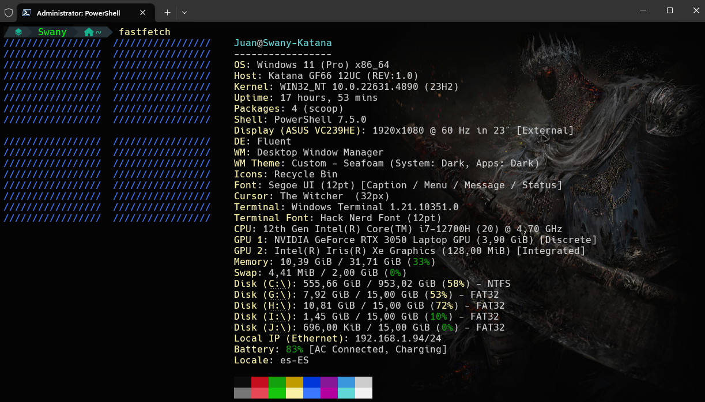

# My Windows Terminal Custom Configuration
<br>
Download [Windows Terminal](https://aka.ms/terminal) and [Hack Nerd Font](https://github.com/ryanoasis/nerd-fonts/releases/download/v3.3.0/Hack.zip) if you haven't already.

## Set Up

### 1. Install Oh My Posh
Run the following command in PowerShell to install **Oh My Posh**:

```powershell
winget install JanDeDobbeleer.OhMyPosh
```

### 2. Clone the Repository
Clone the repository to get the configuration files:

```powershell
git clone https://github.com/Swany75/WinTerminalCustomCfg.git
```

After cloning, move the WinTerminalCustomCfg folder to the Oh My Posh themes folder. 

```powershell
cp .\swany.yml "C:\Users\{{YourUsrName}}\AppData\Local\Programs\oh-my-posh\themes\swany.yml"
```

### 3. Set Up Your Custom Theme

Place your custom theme file, swany.yml, in the Documents/PowerShell/Themes folder (or any location you prefer).

```powershell
notepad $PROFILE
```

```powershell
Import-Module oh-my-posh
Set-PoshPrompt -Theme "C:\Users\{{YourUsrName}}\AppData\Local\Programs\oh-my-posh\themes\swany.yml"
cls
```

Modify the Windows Terminal profile configuration to load your theme.

## Resources

- [Nerd Fonts Cheat Sheet](https://www.nerdfonts.com/cheat-sheet)
- [Oh My Posh Themes Documentation](https://ohmyposh.dev/docs/themes)
- [Customize & Beautify your Windows Terminal (2022 Edition)](https://dev.to/ansonh/customize-beautify-your-windows-terminal-2022-edition-541l)